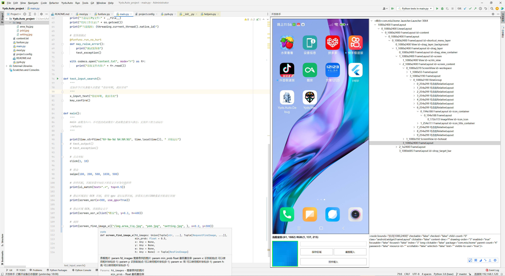

关于 api更新 & 项目例子



## 新一代自动化引擎

[APK以及开发插件下载地址 提取密码密码:yyds](https://chensiji.lanzoum.com/b00qihxte)

[文档网站 https://yydsxx.com/docs/yyds-auto/script](https://yydsxx.com/docs/yyds-auto/script)


## 创建工程示例
1. 创建**project.config**文件, 这是一个简单的ini配置文件，根据你的实际配置变量，所有配置将会影响到你接下来的运行与调试
```python title="工程目录/project.config"
# 注意'#'开头为注释
# [必填]工程名 支持中文英文数字组合，勿加特殊符号!
PROJECT_NAME=test

# [打包必填]工程版本
PROJECT_VERSION=1.0

# [调试必填]调试设备IP地址，在App可以看到
DEBUG_DEVICE_IP=192.168.31.125
```

2. 复制yyds.py到你的工程目录

3. 创建入口代码文件**main.py**
```
# 导入刚刚复制的封装好的python库, 当然你也可以自己修改定制
from yyds import *
```

4. 创建**main**函数
```python title="工程目录/main.py"
# 你的python代码从这里开始运行，main函数会被自动调用
def main():
    toast("你好，老陈")
    click(500, 300)
```